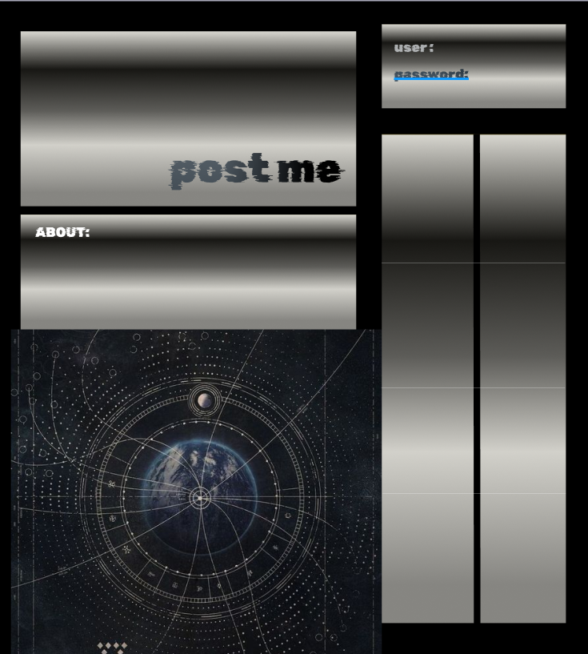

# Post-Me

## List
- Store Database
- Use API? 3rd Party?

## Apps Used 
- Figma or Canva

# About
>Overview
The blogging feature on Blog is designed to post any random thoughts. This tool allows artists to create engaging content that can enhance their online presence, connect with anyone, and promote their work effectively.

>Features
Content Creation: Write and publish blog posts about your stories, and more.

Welcome to Blog Haven—a full-stack blog platform designed and developed to showcase the skills and knowledge accumulated over the past six modules. This project is a testament to our dedication and proficiency in creating a real-world application that meets the highest industry standards. Here’s what sets Blog Haven apart:
Project Features:
Robust Backend with RESTful API:
Utilizes Node.js and Express.js to build a powerful and scalable RESTful API.
Integrates PostgreSQL as the database, managed through Sequelize ORM, ensuring efficient data handling and storage.
Dynamic Templating with Handlebars.js:
Employs Handlebars.js as the template engine to render dynamic content seamlessly.
Comprehensive Routes:
Implements both GET and POST routes for retrieving and adding new data, enhancing the blog’s interactivity.
Innovative Technology:
Integrates at least one new library, package, or technology that extends beyond our current learning, demonstrating our ability to adapt and innovate.
MVC Architecture:
Adheres to the Model-View-Controller (MVC) paradigm, ensuring a clean, maintainable, and organized folder structure.
Secure Authentication:
Includes user authentication using express-session and cookies, ensuring secure access and data protection.
Sensitive information and API keys are safeguarded with environment variables.
Deployment and Data Management:
Deployed using Render, complete with data handling capabilities to provide a real-world experience.
User-Centric Design:
Features a polished and responsive user interface, ensuring accessibility across various devices.
Interactivity is at the core, with the application responding seamlessly to user inputs.
Code Quality and Standards:
Follows good-quality coding standards, including proper file structures, naming conventions, and comprehensive comments, ensuring readability and maintainability.
Professional Documentation:
Accompanied by a detailed README file that includes:
A unique project name: Blog Haven.
A succinct project description.
A list of technologies used.
Screenshots showcasing the application.
A link to the deployed application.
Blog Haven is not just a project; it's a showcase of our collective expertise, ready to impress potential employers and stakeholders alike. Explore the application and witness how a well-rounded, professional-grade blog platform functions.

## 

